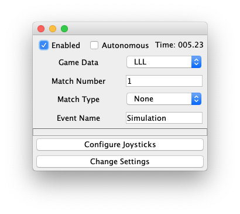

# Step 2

## Overview

For Step 2, we will start adding some actual Robot'ing with our robot code. This will involve adding build steps for wpilib (the FRC base libraries with all of our logic)

## Add frc support to gradle

Add the GradleRIO plugin to build.gradle. Now that we are doing a robot rather than just a simple java application, remove the java-application plugin, and mainClassName stuff.

```gradle
buildscript {
    repositories {
        mavenLocal()
    }
}

// We are a java-library because we build a jar file, but
// we also require the GradleRio plugin for robot stuff
plugins {
    id "java-library"
    id "edu.wpi.first.GradleRIO" version "2019.0.0-alpha-3"
}

// define the robot class for GradleRIO
def ROBOT_CLASS = "frc.robot.Robot"

// Define my targets (RoboRIO) and artifacts (deployable files)
// This is added by GradleRIO's backing project EmbeddedTools.
deploy {
    targets {
        target("roborio", edu.wpi.first.gradlerio.frc.RoboRIO) {
            // Team number is loaded either from the .wpilib/wpilib_preferences.json
            // or from command line. If not found an exception will be thrown.
            // You can use getTeamOrDefault(team) instead of getTeamNumber if you
            // want to store a team number in this file.
            team = getTeamNumber()
        }
    }
    artifacts {
        artifact('frcJava', edu.wpi.first.gradlerio.frc.FRCJavaArtifact) {
            targets << "roborio"
            // Debug can be overridden by command line, for use with VSCode
            debug = getDebugOrDefault(false)
        }
    }
}

dependencies {
    compile wpilib()
    compile ctre()
    compile navx()
}

// Setting up my Jar File. In this case, adding all libraries into the main jar ('fat jar')
// in order to make them all available at runtime. Also adding the manifest so WPILib
// knows where to look for our Robot Class.
jar {
    from configurations.compile.collect { it.isDirectory() ? it : zipTree(it) }
    manifest edu.wpi.first.gradlerio.GradleRIOPlugin.javaManifest(ROBOT_CLASS)
}

// Add a local and remote repository to fetch dependencies from
repositories {
    mavenLocal()
    jcenter()
}

// Force Java 8 Compatibility mode for deployed code, in case the develoment
// system is using Java 10.
compileJava {
    sourceCompatibility = 1.8
    targetCompatibility = 1.8
}

wrapper {
    gradleVersion = '4.9'
}

```

## Add wpilib_preferences.json

Create a new .wpilib/ directory in your project and add wpilib_preferences.json to it

```json
{
    "currentLanguage": "java",
    "teamNumber": 4183
}
```

This will tell the wpi library what your team number and programming language is.

## Add Robot code

Modify our Robot class to make it extend TimedRobot, and override robotInit so we know our stuff is working.

While in the Robot.java file, remove the static main function. We don't need it anymore.

```java
package frc.robot;

import edu.wpi.first.wpilibj.TimedRobot;

public class Robot extends TimedRobot {

    @Override
    public void robotInit() {
        super.robotInit();
        System.out.println("Hello Robot Init!");
    }
}
```

## Simulator
It's always nice to test your code before you deploy it to an actual robot. Let's configure the Snobot Simulator for testing. I have created a custom gradle file that sets up the simulator with team 4183 specific versions of wpilib, snobotSim, ctre, and navx.

Update your build.gradle file with the following apply statement, before the dependencies block:

```gradle
...

// add the simulator before our dependencies
apply from: 'https://raw.githubusercontent.com/cpostbitbuckets/FRCTutorial/master/buildSrc/simulator.gradle'

dependencies {
    compile wpilib()
    compile ctre()

...

```

To run the simulator, call the following:

    gradle runSnobotSim

You should see an empty simulator.


