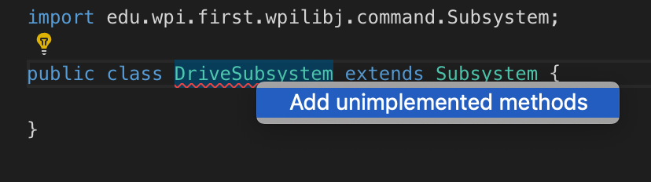
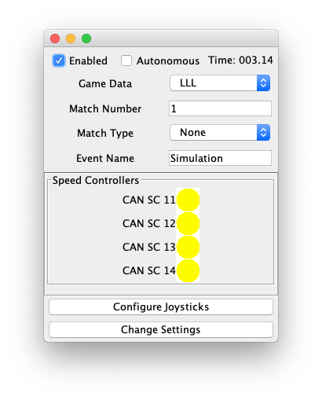

# Step 3

## Overview
In step 3, we are going to add a Drive Subsystem and 4 motors. We are going to configure those motors as if they were on a simple robot with two motors for wheels on the left and two motors for wheels on the right. We want the left motors and the right motors to work together as one motor unit.

## Create a new drive subsystem package

Add a subsystems.drive package under frc.robot

## Add a DriveSubsystem class

Under the subsystems.drive package, add DriveSubsystem.java and have it inherit from Subsystem.
We also have it take an instance of our Robot in the constructor. We will need it later.

```java
package frc.robot.subsystems.drive;

import edu.wpi.first.wpilibj.command.Subsystem;

import frc.robot.Robot;

public class DriveSubsystem extends Subsystem {

    /**
     * Constructor for DriveSubsystem. Pass in the robot instance so we can refer to it later.
     */
    public DriveSubsystem(Robot robot) {
        this.robot = robot;
    }
}
```

This class must implement the initDefaultCommand() method, so override that.

**Note**: Highlight the squiggly class name and hit Cmd+. or Ctrl+. to automatically 



## Add the DriveSystem to the Robot

In the Robot class, create a new instance of the DriveSubsystem in the robotInit() function:

```java
    DriveSubsystem driveSubsystem;

    @Override
    public void robotInit() {
        super.robotInit();

        driveSubsystem = new DriveSubsystem(this);
    }

```

## Motors

Our DriveSubsystem needs motors. Our robot has two motors on the left side and two motors on the right side. We want to create them such that the rear motor follows the front motor on each side.

Also, our motors are tied to id's 11, 12, 13, and 14. For now, just create them like this:

### Motor IDs as Constants
We don't want to just use the numbers 11, 12, 13, and 14 to define our motor ids. It's confusing to follow, and difficult
to change if the wiring of the robot changes. We need to createk some class to hold these constants. For this, create a RobotMap class.

```java
package frc.robot;

/**
 * A Mapping of motor indexes to robots
 */
public class RobotMap {
    
    /* DRIVE SUBSYSTEM */
    public static final int LEFT_DRIVE_MOTOR_FRONT_ID  = 11;
    public static final int LEFT_DRIVE_MOTOR_REAR_ID   = 12;
    public static final int RIGHT_DRIVE_MOTOR_FRONT_ID = 13;
    public static final int RIGHT_DRIVE_MOTOR_REAR_ID  = 14;

}
```

### DriveSubsystem
Now that we have some constants, let's make a [DriveSubsystem](src/main/java/frc/robot/subsystems/drive/DriveSubsystem.java) with 4 motors, 2 on the left and 2 on the right. We also pass along our Robot into this subsystem. We don't need it now, but we'll want the subsystem to be able to ask the robot instance things later (like what state its in)

```java
package frc.robot.subsystems.drive;

import com.ctre.phoenix.motorcontrol.ControlMode;
import com.ctre.phoenix.motorcontrol.can.TalonSRX;

import edu.wpi.first.wpilibj.command.Subsystem;
import frc.robot.Robot;
import frc.robot.RobotMap;

public class DriveSubsystem extends Subsystem {

    private final Robot robot;
    private final TalonSRX leftFrontMotor;
    private final TalonSRX leftRearMotor;

    private final TalonSRX rightFrontMotor;
    private final TalonSRX rightRearMotor;

    public DriveSubsystem(Robot robot) {
        this.robot = robot;
        leftFrontMotor = new TalonSRX(RobotMap.LEFT_DRIVE_MOTOR_FRONT_ID);
        leftRearMotor = new TalonSRX(RobotMap.LEFT_DRIVE_MOTOR_REAR_ID);
        rightFrontMotor  = new TalonSRX(RobotMap.RIGHT_DRIVE_MOTOR_FRONT_ID);
        rightRearMotor   = new TalonSRX(RobotMap.RIGHT_DRIVE_MOTOR_REAR_ID);        
    }
}
```

### Inverted Motors
As configured above, all of our motors will spin the same direction, but some are on the left side while other are on the right. This means "forward" for the right is "reverse" for the left. We want to tell both the left and right side "go forward" or "go reverse" at the same time. To handle this, we need to set the motors on one side to be inverted.

Add a couple more constants to your [RobotMap.java](src/main/java/frc/robot/RobotMap.java)

```java
    /* DRIVE SUBSYSTEM */
    // DriveSubsystem Motor Directions
    // Assuming a single stage gearbox and motors mounted on
    // interior with axle pointing outward. Using right hand
    // rule for positive motor command yields the following:
    //		Left			Right
    //		INVERTED		NOT-INVERTED
    public static final boolean LEFT_DRIVE_MOTOR_INVERSION_FLAG = true;
    public static final boolean RIGHT_DRIVE_MOTOR_INVERSION_FLAG = false;

```

Then, update your DriveSubsystem constructor to configuring these motors to be inverted or not
```java
    public DriveSubsystem() {
        // ... motors created above
        
        leftFrontMotor.setInverted(RobotMap.LEFT_DRIVE_MOTOR_INVERSION_FLAG);
        leftRearMotor.setInverted(RobotMap.LEFT_DRIVE_MOTOR_INVERSION_FLAG);

        rightFrontMotor.setInverted(RobotMap.RIGHT_DRIVE_MOTOR_INVERSION_FLAG);
        rightRearMotor.setInverted(RobotMap.RIGHT_DRIVE_MOTOR_INVERSION_FLAG);
    }

```

### Motors that follow
The TalonSRX motors come with some helpful functionality to tell one motor to follow another. This means you can set the 
speed of one motor, and any following motors will match. 

```java
    public DriveSubsystem() {
        // ... motors created and inverted above
        
        // Use follower mode to minimize shearing commands that could occur if
        // separate commands are sent to each motor in a group
        leftRearMotor.follow(leftFrontMotor);
        leftRearMotor.set(ControlMode.Follower, leftFrontMotor.getDeviceID());
        rightRearMotor.follow(rightFrontMotor);        
        rightRearMotor.set(ControlMode.Follower, rightFrontMotor.getDeviceID());
    }
```

### Default to Idling
Now we have a robot, a drive subsystem, and four motors. To begin with, we don't want them to do anything, so let's create a new Idle Command. This command essentially does nothing, but our DriveSubsystem requires a default command to start.

This class is pretty simple. It needs to know about our driveSubsystem (and will use it later), but for now we want this command to call requires() on the driveSubsystem. This will ensure that when the Idle command is running, no other commands that require this subsystem will be able to run.

```java
package frc.robot.subsystems.drive;

import edu.wpi.first.wpilibj.command.Command;

public class Idle extends Command {

    private final DriveSubsystem driveSubsystem;

    public Idle(DriveSubsystem driveSubsystem) {
        this.driveSubsystem = driveSubsystem;

        // Use requires() here to declare subsystem dependencies
        requires(driveSubsystem);
        setRunWhenDisabled(true);  // Idle state runs when disabled, unlike other states
    }

    @Override
    protected boolean isFinished() {    
        // idle forever, we don't change state yet
        return false;
    }

}

```

## Test it

If you have the SnobotSim setup, you can run it now:

    gradle runSnobotSim

You should see a simulator with 4 motors, doing nothing.


