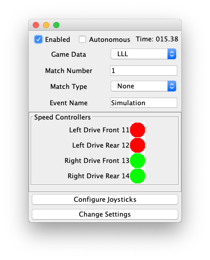
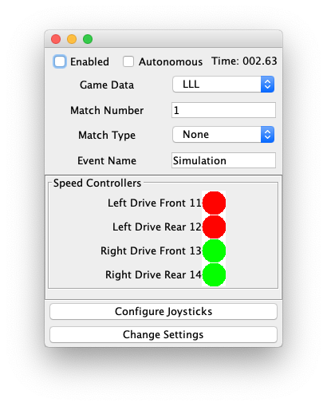

# Step 4

In step 3 we created a Drive Subsystem with 4 motors. The subsystem only idles. We need to add a joystick to steer our robot around. We are going to setup a joystick to do a tank drive style. This will mean one joystick on the controller will move forward and backward, and another will turn the robot left and right.

## DriveSubsystem.tankDrive()
The first thing we need is some logic to tell the robot to move around based on joystick inputs. Create a new method in DriveSubsystem called tankDrive(). This method will take two inputs, the forward/backward amount of the joystick, and the left/right turn amount of the joystick.

```java
/**
     * Drive the robot like a tank. This will take two inputs,
     * the forward joystick setting (between -1 and 1) and the
     * turn joystick setting (between -1 and 1)
     * 
     * For tank drive, we have a few options
     * <ul>
     * <li>Drive forward: both motors on as much as the joystick is pushed forward</li>
     * <li>Drive backward: both motors on in reverse as much as the joystick is pushed backward</li>
     * <li>Turn right: left motors reversed, right motors forward as much as the joystick is pushed right</li>
     * <li>Turn left: left motors forward, right motors reversed as much as the joystick is pushed left</li>
     * <li>Drive forward and turn: Motors are blended based on the intensity of the joysticks</li>
     * </ul>
     */
    public void tankDrive(double forward, double turn) {
        // If we are turning and moving forward at the same time, reduce how much we turn
        // If we are going full forward, this will be
        // 1.0 - (1.0/2.0) or 0.5
        // i.e. only steer half as much
        //
        // If we are not going forward at all, this will be 
        // 1.0 - 0.0 / 2.0 or 1.0
        // i.e. steer as much as possible
        double maxSteer = 1.0 - Math.abs(forward) / 2.0;	// Reduce steering by up to 50%
        
        // Based on what we calculated above, reduce our "steering" rate
        double steer = maxSteer * turn;
        
        // Set the motors based on how much we are going forward/backward and how
        // much we are steering left or right
		leftFrontMotor.set(ControlMode.PercentOutput, forward + steer);
        rightFrontMotor.set(ControlMode.PercentOutput, forward - steer);
        
    }
    
```

This function is a bit complicated because it tries to adjust the motor percent output based on steering. If you aren't going forward or backward, the steering fully engages the motors. Otherwise, the steering amount is reduced based on how much we are moving forward or backward.

## Adding a Joystick to the Robot.
Adding a joystick to your robot with wpilib is pretty simple. Add a new joystick member to your Robot.java class:

```java
    public class Robot extends TimedRobot {
    // before methods
    
    private XboxController driverJoystick;
    
    // methods on the bottom

```

Next we need to initialize the joystick. Because the DriverStation supports multiple joysticks, you have to give each joystick an id. This one will be id 0. First add a new constant to the [RobotMap.java](src/main/java/frc/robot/RobotMap.java)

```java
    /* Joysticks */
    public static final int JOYSTICK_DRIVER_ID = 0;

```

Now update your [Robot.java](src/main/frc/robot/Robot.java) robotInit() function to initialize the joystick

```java
    @Override
    public void robotInit() {
        super.robotInit();

        driveSubsystem = new DriveSubsystem();
        // initalize this joystick with Id 0
        driverJoystick = new XboxController(RobotMap.JOYSTICK_DRIVER_ID);
    }

```

## Robot.teleopPeriodic()
The WPI robot class contains methods you can override for the various states a robot is in. Disabled, Autonomous, Teleop (i.e. driver controlled), and Test. For joystick support, we need to override teleopPeriodic(). The teleopPeriodic method gets called each time the robot sends us a ping. For a TimedRobot, this is about every 20ms. This is where we want to tell our DriveSubsystem to do the tankDrive, based on the inputs on the joystick.

```java

    /**
     * Override teleopPeriodic to get inputs from the joystick and move the robot around with the DriveSubsystem.
     */
    @Override
    public void teleopPeriodic() {
        // For the xbox controller, pushing the stick forward returns -1. Weird
        double forward = -driverJoystick.getY(Hand.kLeft);
        double turn  = driverJoystick.getX(Hand.kRight);

        driveSubsystem.tankDrive(forward, turn);
    }

```

Now is a good time to test it!

    gradle runSnobotSim

If you push the right stick to turn left or right, you should see something like this:



Everything looks great! Our joystick is turning the left motors in reverse, and the right motors full speed ahead. We have a tank driving robot.

## Stopping
Just for fun, when running simulation, keep your robot turning or moving forward, and click the Enabled checkbox to disable the robot. Notice that the motors are still going full speed! Uh oh.



We can solve this pretty easily by adding a stop() function to our DriveSubsystem and calling it when we enter the disabled mode. To DriveSubsystem.java, add a stop method:

```java
    /**
     * Stop the motors
     */
    public void stop() {
        leftFrontMotor.set(ControlMode.PercentOutput, 0);
        rightFrontMotor.set(ControlMode.PercentOutput, 0);
    }

```

Now, update Robot.java to call stop when we enter the disabled state
```java
    /**
     * Stop the motors when we disable the robot
     */
    @Override
    public void disabledInit() {
        System.out.println("Robot disabled, stopping motors");
        this.driveSubsystem.stop();
    }

```

Now launch the simulator again, and the motors should turn off when you uncheck Enabled.


